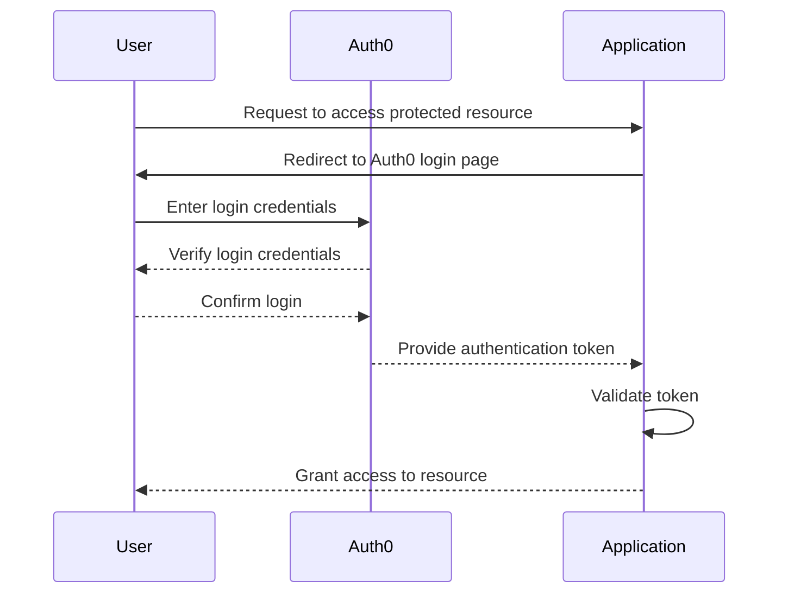

This is a [Next.js](https://nextjs.org/) project bootstrapped with [`create-next-app`](https://github.com/vercel/next.js/tree/canary/packages/create-next-app).

- [Getting Started](#getting-started)
- [Learn More](#learn-more)
- [Deploy on Vercel](#deploy-on-vercel)
- [Auth0 Workflow](#auth0-workflow)
- [Auth0 Configuration](#auth0-configuration)
- [Configure SDK](#configure-sdk)
- [Auth0 APIs](#auth0-apis)
- [การใช้งาน](#การใช้งาน)
- [ตั้งค่าใน Auth0 dashboard settings](#ตั้งค่าใน-auth0-dashboard-settings)
- [User Management](#user-management)
- [Profile page](#profile-page)
  - [Redirecting to the profile page](#redirecting-to-the-profile-page)
- [RBAC (Role-Based Access Control)](#rbac-role-based-access-control)
  - [การสร้าง API](#การสร้าง-api)
  - [สร้าง Permission](#สร้าง-permission)
  - [เพิ่ม Permission ให้กับ User](#เพิ่ม-permission-ให้กับ-user)
  - [กำหนด audience ให้กับ API](#กำหนด-audience-ให้กับ-api)
  - [JWT Decode](#jwt-decode)
  - [สร้าง Role](#สร้าง-role)
  - [สรุป](#สรุป)
- [Flow](#flow)

## Getting Started

First, run the development server:

```bash
npm run dev
# or
yarn dev
# or
pnpm dev
# or
bun dev
```

Open [http://localhost:3000](http://localhost:3000) with your browser to see the result.

You can start editing the page by modifying `app/page.js`. The page auto-updates as you edit the file.

This project uses [`next/font`](https://nextjs.org/docs/basic-features/font-optimization) to automatically optimize and load Inter, a custom Google Font.

## Learn More

To learn more about Next.js, take a look at the following resources:

- [Next.js Documentation](https://nextjs.org/docs) - learn about Next.js features and API.
- [Learn Next.js](https://nextjs.org/learn) - an interactive Next.js tutorial.

You can check out [the Next.js GitHub repository](https://github.com/vercel/next.js/) - your feedback and contributions are welcome!

## Deploy on Vercel

The easiest way to deploy your Next.js app is to use the [Vercel Platform](https://vercel.com/new?utm_medium=default-template&filter=next.js&utm_source=create-next-app&utm_campaign=create-next-app-readme) from the creators of Next.js.

Check out our [Next.js deployment documentation](https://nextjs.org/docs/deployment) for more details.

## Auth0 Workflow



## Auth0 Configuration

เริ่มที่การสร้่าง Application ที่ Auth0 dashboard ที่นี่ [Auth0 Dashboard](https://manage.auth0.com/dashboard)

จากนั้น สร้าง Next.js ขึ้นมา แล้วติดตั้ง `auth0` โดยใช้คำสั่ง

```bash
npm install @auth0/nextjs-auth0
```

## Configure SDK

สร้างไฟล์ `.env.local` และเพิ่มข้อมูลดังนี้

```bash
AUTH0_SECRET='use [openssl rand -hex 32] to generate a 32 bytes value'
AUTH0_BASE_URL='http://localhost:3000'
AUTH0_ISSUER_BASE_URL='YOUR_AUTH0_ISSUER_BASE_URL'
AUTH0_CLIENT_ID='YOUR_AUTH0_CLIENT_ID'
AUTH0_CLIENT_SECRET='YOUR_AUTH0_CLIENT_SECRET'
```

## Auth0 APIs

Auth0 จะมี APIs ที่ใช้ในการทำงาน ดังนี้

- `/api/auth/login` - ใช้ในการเข้าสู่ระบบ
- `/api/auth/logout` - ใช้ในการออกจากระบบ
- `/api/auth/me` - ใช้ในการดึงข้อมูลของผู้ใช้
- `/api/auth/callback` - ใช้ในการรับข้อมูลจาก Auth0 หลังจากที่ผู้ใช้เข้าสู่ระบบ

## การใช้งาน

นำเอา `auth0` มาติดตั้งใน `app/layout.js` ก่อน

```javascript
import { UserProvider } from '@auth0/nextjs-auth0'

export default function RootLayout({ children }) {
  return (
    <html lang="en">
      <UserProvider>
        <body className={inter.className}>{children}</body>
      </UserProvider>
    </html>
  )
}
```

จากนั้น นำเอา `<a href="/api/auth/login">Login</a>` ไปเพิ่มใน `app/page.js` เพื่อให้ไปหน้า login

แต่ยังไม่สามารถ login ได้เพราะยังไม่ได้ตั้งค่าใน Auth0 ให้เรียบร้อย

## ตั้งค่าใน Auth0 dashboard settings

เข้าไปที่ dashboard > Applications > Applications > เลือก application ที่เราสร้างขึ้นมา > Settings

1. ไปที่ [Auth0 Dashboard](https://manage.auth0.com/dashboard)
2. ไปที่ `Applications` แล้วสร้าง Application ใหม่
3. ตั้งค่า `Allowed Callback URLs` เป็น path ที่เราต้องการให้ redirect เมื่อกด login เช่น `http://localhost:3000/api/auth/callback`
4. ตั้งค่า `Allowed Web Origins` ให้ตรงกับที่เราใช้งาน เช่น `http://localhost:3000`
5. ตั้งค่า `Allowed Origins (CORS)` ให้ตรงกับที่เราใช้งาน เช่น `http://localhost:3000`
6. ตั้งค่า `Application URIs` ให้ตรงกับที่เราใช้งาน เช่น `http://localhost:3000`
7. ตั้งค่า `Token Endpoint Authentication Method` ให้เป็น `Post`
8. ตั้งค่า `Use Auth0 instead of the IdP to do Single Sign On` ให้เป็น `True`
9.  ตั้งค่า `OIDC Conformant` ให้เป็น `True`
10. ตั้งค่า `Application Type` ให้เป็น `Regular Web Application`
11. ตั้งค่า `Allowed Logout URLs` ให้เป็น path ที่เราต้องการให้ redirect หลังจาก logout แล้ว เช่น `http://localhost:3000`

จากนั้น กด `Save Changes`

เมื่อทำการตั้งค่าเรียบร้อยแล้ว ก็สามารถ login ได้แล้ว

## User Management

เมื่อมีการ login เข้ามา เราสามารถดูคนที่ login ได้ โดยเข้าไปดูที่ dashboard > User Management > Users

จะเห็นหน้่ารายชื่อของคนที่ login เข้ามาทั้งหมด

## Profile page

เราสามารถดึงข้อมูลของผู้ใช้ที่ login เข้ามาได้ 

ถ้าดึงข้อมูลแบบ Server-side ให้ใข้ `useUser` จาก `@auth0/nextjs-auth0`

```javascript
// app/profile/page.js
import { getSession } from '@auth0/nextjs-auth0'

export default async function ProfileServer() {
  const { user } = await getSession()

  return (
      user && (
          <div>
            
            <h2>{user.name}</h2>
            <p>{user.email}</p>
          </div>
      )
  )
}
```

ถ้าต้องการ ดึง แบบ Client-side ให้ใช้ `useUser` จาก `@auth0/nextjs-auth0/client`

```javascript
// app/profile/page.js
'use client'

import { useUser } from '@auth0/nextjs-auth0/client'

export default function ProfileClient() {
  const { user, error, isLoading } = useUser()

  if (isLoading) return <div>Loading...</div>
  if (error) return <div>{error.message}</div>

  return (
    user && (
      <div>
        
        <h2>{user.name}</h2>
        <p>{user.email}</p>
      </div>
    )
  )
}
```

เราจะสามารถดึงข้อมูลมาแสดงได้เหมือนกับเรียก API `GET /api/auth/me`

### Redirecting to the profile page

เราสามารถทำการ redirect ไปที่ หลังจาก login แล้ว ให้ไปที่ profile page ได้ และถ้าไม่ได้ login ก็ให้ไปที่หน้า login แทน
โดยใช้ `middleware.js`

```javascript
import { NextResponse } from 'next/server'
import {
  withMiddlewareAuthRequired,
  getSession,
} from '@auth0/nextjs-auth0/edge'

export default withMiddlewareAuthRequired(async (req) => {
  const res = NextResponse.next()
  const user = await getSession(req, res)
  if (!user) {
    return NextResponse.redirect('/api/auth/login')
  }
  return res
})

export const config = {
  matcher: '/profile',
}
```

และเพิ่ม `haddleLogin` ใน `app/api/auth/[auth0]/route.js`

```javascript
import { handleAuth, handleLogin } from '@auth0/nextjs-auth0'

export const GET = handleAuth({
  login: handleLogin({
    returnTo: '/profile',
  }),
})
```

## RBAC (Role-Based Access Control)

การสร้าง Permission โดยแบ่งตาม Role ใน Auth0 และให้สิทธิ์ในการเข้าถึง API ต่าง ๆ

### การสร้าง API

1. ไปที่ dashboard > APIs > APIs
2. กด `Create API`
3. กรอกข้อมูลดังนี้
   - Name: ชื่อ API
   - Identifier: ชื่อ API ที่เราต้องการให้มี ในที่นี้เราให้เป็น `http://localhost:3000`
   - Signing Algorithm: ให้เลือก `RS256`
  แล้วกด `Create`

### สร้าง Permission

1. ไปที่ dashboard > APIs > APIs
2. เลือก API ที่เราสร้างขึ้นมา
3. ไปที่ `Permissions` แล้วกด `Create Permission`
4. กรอกข้อมูลดังนี้
   - Name: ชื่อ Permission
   - Description: คำอธิบายของ Permission
 - แล้วกด `add`

สามารถสร้าง permission ได้หลาย ๆ อัน

จากนั้นไปที่ `settings` แล้วเลือก `RBAC` แล้วกด enable `Enable RBAC` และ `Add Permissions in the Access Token` แล้วกด `Save`

### เพิ่ม Permission ให้กับ User

1. ไปที่ dashboard > User Management > Users
2. เลือก User ที่เราต้องการให้มี Permission
3. ไปที่ `Permissions` แล้วกด `Assign Permissions`
4. ให้เลือก API ที่เราสร้างขึ้นมา
5. ให้เลือก Permission ที่เราสร้างขึ้นมา
6. แล้วกด `Add Permissions`

### กำหนด audience ให้กับ API

เราต้องการให้ API ที่เราสร้างขึ้นมา รู้ว่าเราต้องการให้มีการเข้าถึง Permission ที่เราสร้างขึ้นมา ดังนั้นเราต้องกำหนด `audience` ให้กับ API ด้วย

`audience` คือ ชื่อ API ที่เราสร้างขึ้นมา เช่น `http://localhost:3000`

ส่วนของ Next.js ที่เราต้องการให้มีการเข้าถึง Permission ที่เราสร้างขึ้นมา ต้องกำหนด `audience` ให้กับ API ด้วย

```javascript
// app/api/auth/[auth0]/route.js
import { handleAuth, handleLogin } from '@auth0/nextjs-auth0'

export const GET = handleAuth({
  login: handleLogin({
+    authorizationParams: {
+      audience: "http://localhost:3000",
+    },
    returnTo: '/profile',
  }),
})
```

### JWT Decode

ติดตั้ง `jwt-decode` เพื่อใช้ในการ decode token ที่ได้จาก Auth0

```bash
npm install jwt-decode
```

จากนั้นเราสามารถดึงข้อมูลของ token ที่ได้จาก Auth0 ได้ และดูว่ามี Permission อะไรบ้าง

```javascript
// middleware.js

...
const user = await getSession(req, res)
...

const userPermissionData = jwtDecode(user.accessToken)
console.log(userPermissionData)

...
```

เราจะเห็นว่ามีข้อมูลของ Permission ที่เราสร้างขึ้นมา

```bash
userPermissionData {
  iss: '...',
  sub: '...',
  aud: [ 'http://localhost:3000', '...' ],
  iat: 1710172049,
  exp: 1710258449,
  azp: '...',
  scope: 'openid profile email',
  permissions: [ 'read:next-auth-test' ]
}
```

สังเกตว่า `userPermissionData` ที่เราสร้างขึ้นมา มี `scope` และ `permissions` 

`scope` คือ ข้อมูลของ User ที่ application สามารถดึงข้อมูลมาใช้ได้ ซึ่งปกติจะมี `openid profile email` ที่ผ่านการขออนุญาตจาก User แล้ว

ส่วน `permissions` คือ สิทธิ์ที่เราสามารถทำได้ ใน application ใดๆ

เราสามารถเพิ่ม `scope` ด้วย `permissions` ได้ เพิ่มสิทธิ์ให้กับ user ใน application นั้น ๆ เช่น `read:next-auth-test`

```javascript
// app/api/auth/[auth0]/route.js
import { handleAuth, handleLogin } from '@auth0/nextjs-auth0'

export const GET = handleAuth({
  login: handleLogin({
    authorizationParams: {
      audience: "http://localhost:3000",
+      scope: "openid profile email read:next-auth-test"
    },
    returnTo: '/profile',
  }),
})
```

เมื่อ login อีกที เราจะเจอส่วนของการขออนุญาตใช้ `scope` นี้เพิ่มขึ้นมา

ทีนี้ เราจะได้ `scope` เป็น `openid profile email read:next-auth-test` แล้ว

```bash
userPermissionData {
  iss: '...',
  sub: '...',
  aud: [ 'http://localhost:3000', '...' ],
  iat: 1710172049,
  exp: 1710258449,
  azp: '...',
  scope: 'openid profile email read:next-auth-test',
  permissions: [ 'read:next-auth-test' ]
}
```

### สร้าง Role

เราสามารถสร้าง Role ให้กับ User ได้ และกำหนด Permission ให้กับ Role นั้น ๆ

1. ไปที่ dashboard > User Management > Roles
2. กด `Create Role`
3. กรอกข้อมูลดังนี้
   - Name: ชื่อ Role
   - Description: คำอธิบายของ Role
   - แล้วกด `Create`
4. กด `Add Permissions` > เลือก API ที่เราสร้างขึ้นมา > เลือก Permission ที่มี
5. กด `Add Users` เพื่อกำหนด User ที่เราต้องการให้มี Role นี้ แล้วกด `Save`
6. เข้าไปดูใน User ที่เรากำหนด Role ไว้ จะเห็นว่ามี Role ที่เรากำหนดไว้ และมี Permission ที่เรากำหนดใน Role เพิ่มมาด้วย

### สรุป

เราสามารถกำหนดสิทธิ์ให้กับ User ได้ โดยการกำหนด Permission ให้กับ User โดยตรง หรือกำหนด Permission ให้กับ Role แล้วกำหนด Role ให้กับ User ได้ เราเรียก Role ว่า เป็นการ group permissions ไว้ด้วยกัน

## Flow

Flow คือ การแทรกการทำงานระหว่างกลางของ application และ Auth0 โดยเราสามารถทำได้หลายอย่าง เช่น

- `Login Flow` - การทำงานเมื่อมีการ login
- `Machine to Machine Flow` - การทำงานก่อน token issued เสร็จ
- `Pre User Registration Flow` - การทำงานก่อนมีการลงทะเบียน
- `Post User Registration Flow` - การทำงานเมื่อมีการลงทะเบียน
- `Post Change Password Flow` - การทำงานเมื่อมีการเปลี่ยนรหัสผ่าน
- `Send Phone Message Flow` - การทำงานก่อนการส่งข้อความไปยังโทรศัพท์
- `Password Reset / Post Challenge Flow` - การทำงานเมื่อมีการเปลี่ยนรหัสผ่านหลังจากที่ทำการ reset password